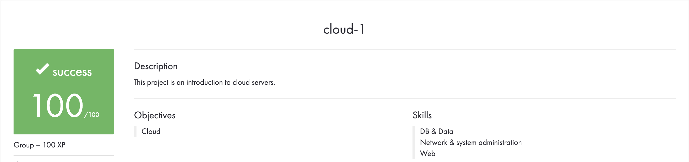

# CLOUD 1

## Prerequisites
* Hosting service account (AWS, GCP or DigitalOcean)
>**NOTE** : Be cautious of costs, try getting free credits via the GitHub student package.

## Description
Introduction to databases, data and cloud servers. 
Hosting a wordpress site on the cloud, with auto scaling, load balancing and CDN.

## Overall Achievements
<!--  -->
(Image to be uploaded upon marking)

## File Structure
```
cloud_1
│
│   README.md
│   useful-links.txt
│   
└───docs
│
│   (name of pic for diagram)
│   cloud-1.en.pdf
│   overview.png (to be uploaded after marking)
│
└───wordpress-beanstalk-v6.zip (wordpress image to be deployed)
```
## Deployment
Key features for deployment
* At least 2 EC2 instances
* An RDS instance
* Security Group
* CloudFront (CDN)
* An Elastic Beanstalk Environment
* Wordpress image for deployment


> **NOTE** : This project was done with AWS and deployed using their services, hence the AWS jargon.